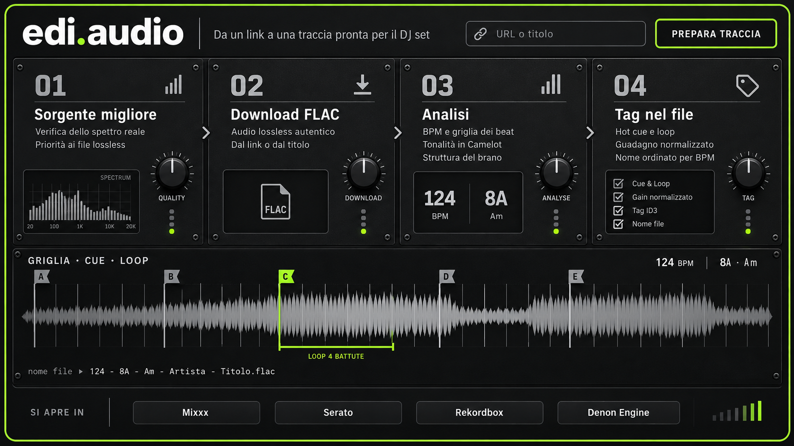

# edi.audio — Design System

> **Da un link a una traccia pronta per il DJ set.**
> Versione 2.0 · settembre 2026 · riferimento visivo: `brand/edi-audio-mixer.png`



---

## 1. Concetto: l'interfaccia è un mixer

edi.audio non si presenta come una web app: si presenta come **un pezzo di
hardware da DJ**. Pannelli neri avvitati, schermi LCD incassati, manopole, LED
di stato e un unico colore acceso — il verde lime — che dice sempre la stessa
cosa: *questo è pronto, questo è attivo, qui c'è segnale*.

La metafora non è decorativa. Chi usa edi.audio passa dal browser a Mixxx e al
controller: l'interfaccia deve sembrare parte dello stesso banco, parlare la
stessa lingua (BPM, Camelot, cue, loop, deck) e leggersi al buio.

### Principi

| # | Principio | Cosa significa in pratica |
|---|-----------|---------------------------|
| 1 | **Un solo colore acceso** | Il lime è riservato a stato attivo, azione primaria e “pronto”. Mai decorativo, mai per il testo lungo. Se tutto è lime, niente è pronto. |
| 2 | **I numeri comandano** | BPM, chiave e numero di fase sono i dati più grandi della pagina, in cifre condensate. Il testo spiega, i numeri informano. |
| 3 | **Hardware, non card** | I contenitori sono pannelli: bordo sottile, viti agli angoli, schermi incassati. Niente ombre morbide fluttuanti, niente angoli molto arrotondati. |
| 4 | **Buio di default** | Si lavora in console, spesso di notte e accanto a un controller. Il tema è solo scuro. |
| 5 | **Il file è la verità** | Ogni valore mostrato è letto dai tag del file. L'interfaccia non promette ciò che il file non contiene. |

---

## 2. Logo

**Wordmark:** `edi.audio` in Barlow ExtraBold (800), tracking −2%, bianco
carta. Il punto è un **cerchio lime pieno**: è il LED del marchio, il “segnale
presente” fra il nome e il suo mestiere.

```
edi●audio        ● = --lime  (#B6F23C)
```

| Regola | Valore |
|---|---|
| Area di rispetto | altezza della “d” su tutti i lati |
| Dimensione minima | 96 px di larghezza (schermo), 20 mm (stampa) |
| Su fondo chiaro | wordmark `--ink-1`, punto lime invariato solo se il fondo è ≥ `--steel-2`; altrimenti punto `--ink-1` |
| Da non fare | contorni, gradienti, ombre, lime sul nome, punto quadrato |

**Lockup orizzontale:** wordmark · filetto verticale 1 px `--ink-5` · tagline
in Barlow Regular `--steel-2` (“Da un link a una traccia pronta per il DJ set”).

**Favicon / icona:** cerchio lime su quadrato `--ink-1` con raggio 22%.

---

## 3. Colore

### Neutri (“ink” e “steel”)

La scala è ricavata direttamente dal pannello di riferimento. Gli *ink* sono
le superfici, gli *steel* il testo e i dettagli metallici.

| Token | Hex | Uso |
|---|---|---|
| `--ink-0` | `#08090A` | Fondo pagina, telaio esterno |
| `--ink-1` | `#0D0E0F` | Fondo di sezione, barra inferiore |
| `--ink-2` | `#121313` | Pannello (modulo) |
| `--ink-3` | `#18191A` | Superficie rialzata: input, chip, pulsanti secondari |
| `--ink-4` | `#232527` | Filetti interni, griglia forma d'onda, separatori |
| `--ink-5` | `#3C3E40` | Bordo di input e pulsanti, filetti verticali |
| `--steel-4` | `#5E6065` | LED spenti, viti, icone disabilitate — **non per testo** |
| `--steel-3` | `#8E9094` | Testo terziario, etichette assi, placeholder |
| `--steel-2` | `#B9BBBE` | Testo secondario, descrizioni dei moduli |
| `--paper` | `#EEEFF0` | Testo primario, titoli, cifre |

### Accento

| Token | Hex | Uso |
|---|---|---|
| `--lime` | `#B6F23C` | Azione primaria, LED acceso, cue/loop selezionati, punto del logo |
| `--lime-hi` | `#D4FF72` | Hover dell'azione primaria |
| `--lime-lo` | `#7FB51E` | Pressed, LED a bassa intensità |
| `--lime-glow` | `rgba(182,242,60,.35)` | Alone dei LED e del focus |
| `--lime-wash` | `rgba(182,242,60,.10)` | Fondo di regioni selezionate (loop, riga attiva) |

### Semantici

Usati **solo** per stato, mai come decorazione. Il “successo” è il lime: non
esiste un secondo verde.

| Token | Hex | Uso |
|---|---|---|
| `--ok` | = `--lime` | Pronto, lossless verificato |
| `--warn` | `#F5B83D` | Sorgente lossy di buona qualità, configurazione da completare |
| `--err` | `#FF5A4E` | Errore, sorgente ricodificata/scartata |

### Colori funzionali dei cue

I pallini dei cue nella libreria mantengono **il colore che avranno in Mixxx**
(è un'informazione, non un tema). È l'unica eccezione alla regola del colore
unico; nell'illustrazione della forma d'onda i cue sono invece grigio acciaio e
il cue attivo è lime.

### Contrasto (WCAG 2.1)

| Primo piano | su `--ink-1` | su `--ink-3` |
|---|---|---|
| `--paper` | 16.8 : 1 | 15.3 : 1 |
| `--steel-2` | 10.0 : 1 | 9.2 : 1 |
| `--steel-3` | 6.0 : 1 | 5.5 : 1 |
| `--lime` | 14.5 : 1 | 13.2 : 1 |
| `--warn` | 10.9 : 1 | 9.9 : 1 |
| `--err` | 6.3 : 1 | 5.7 : 1 |
| `--steel-4` | 3.1 : 1 ✗ testo | 2.8 : 1 ✗ testo |
| `--ink-1` su `--lime` | 14.5 : 1 | — |

Tutte le coppie di testo superano AA; `--steel-4` è riservato a elementi non
testuali.

---

## 4. Tipografia

Tre famiglie, tutte Google Fonts / OFL.

| Ruolo | Famiglia | Pesi | Note |
|---|---|---|---|
| **Display & UI** | Barlow | 400 · 500 · 600 · 700 · 800 | Il wordmark, i titoli dei moduli, il testo |
| **Cifre & label hardware** | Barlow Condensed | 600 · 700 | Numeri di fase, BPM, chiave, etichette dei controlli |
| **Dati & file** | JetBrains Mono | 400 · 500 | Nomi file, comandi, timecode |

### Scala

| Token | Dimensione / interlinea | Famiglia · peso | Esempio |
|---|---|---|---|
| `--t-wordmark` | 56 / 1.0, tracking −0.02em | Barlow 800 | edi.audio |
| `--t-phase` | 48 / 1.0 | Barlow Condensed 700, `--ink-5`→`--steel-3` | 01 |
| `--t-readout` | 40 / 1.0, cifre tabulari | Barlow Condensed 700 | 124 · 8A |
| `--t-title` | 26 / 1.15 | Barlow 600 | Sorgente migliore |
| `--t-body` | 15 / 1.5 | Barlow 400 | Verifica dello spettro reale |
| `--t-label` | 12 / 1.2, **MAIUSCOLO**, tracking +0.14em | Barlow 600 | GRIGLIA · CUE · LOOP |
| `--t-micro` | 10 / 1.2, maiuscolo, tracking +0.12em | Barlow Condensed 600 | SPECTRUM · 20 · 1K · 20K |
| `--t-mono` | 14 / 1.4 | JetBrains Mono 400 | 124 - 8A - Am - Artista - Titolo.flac |

Regole:

- Le **cifre** sono sempre tabulari (`font-variant-numeric: tabular-nums`) così
  le colonne di BPM non ballano.
- Le **label** dei controlli (QUALITY, DOWNLOAD, ANALYSE, TAG, SI APRE IN) sono
  in maiuscolo spaziato: sono serigrafie sul pannello, non frasi.
- I **titoli** sono in maiuscolo solo iniziale.

---

## 5. Spazio, forma, profondità

**Griglia di base 4 px.** Scala: `4 · 8 · 12 · 16 · 24 · 32 · 48 · 64`.

| Token | Valore | Uso |
|---|---|---|
| `--r-xs` | 3 px | LED rettangolari, barre di livello |
| `--r-sm` | 6 px | Pulsanti, input, chip, schermi LCD |
| `--r-md` | 8 px | Pannelli (moduli) |
| `--r-frame` | 18 px | Telaio esterno del dispositivo |

**Bordi.** 1 px `--ink-4` per i pannelli, 1 px `--ink-5` per input e
pulsanti, 2 px `--lime` per l'azione primaria e il telaio.

**Profondità** — si ottiene con luce, non con ombre portate:

```css
/* pannello: lieve luce dall'alto + bordo */
background: linear-gradient(180deg, #171919 0%, #121313 100%);
box-shadow: inset 0 1px 0 rgba(255,255,255,.04), 0 1px 0 rgba(0,0,0,.6);

/* schermo incassato */
background: #0E0F0F;
box-shadow: inset 0 2px 6px rgba(0,0,0,.7), inset 0 0 0 1px #232527;

/* LED acceso */
background: var(--lime);
box-shadow: 0 0 6px var(--lime-glow), 0 0 14px var(--lime-glow);
```

**Texture.** Un rumore fine al 3% sui pannelli è ammesso (effetto metallo
spazzolato); mai sulle superfici di testo lungo.

---

## 6. Componenti

### 6.1 Modulo (pannello)

Il contenitore di base. Quattro **viti** agli angoli (cerchio 7 px `--ink-5`
con taglio `--ink-1`), intestazione con **numero di fase** a sinistra e
**icona** a destra, filetto `--ink-4` sotto l'intestazione, poi titolo e testo.

```
◦───────────────────────────────◦
│ 01                        ▮▮▮ │
│ ───────────────────────────── │
│ Sorgente migliore             │
│ Verifica dello spettro reale  │
│ ┌──────────────┐    ( ◉ )     │
│ │   SCHERMO    │   QUALITY    │
│ └──────────────┘      •••●    │
◦───────────────────────────────◦
```

Fra moduli in sequenza: chevron `›` `--steel-2`.

### 6.2 Schermo (LCD)

Area incassata per dati vivi: spettro, file, readout, checklist. Fondo
`#0E0F0F`, ombra interna, raggio `--r-sm`, label micro in alto a destra
(es. `SPECTRUM`).

### 6.3 Readout BPM / chiave

Due cifre grandi separate da un filetto verticale, con unità sotto in
`--t-label` `--steel-2`:

```
 124  │  8A
 BPM  │  Am
```

In linea (intestazioni, righe di tabella): `124 BPM │ 8A · Am`.

### 6.4 Pulsanti

| Variante | Aspetto | Uso |
|---|---|---|
| **Primario** | Fondo `--ink-1`, bordo 2 px `--lime`, testo `--paper` Barlow 700 maiuscolo, tracking +0.12em. Hover: fondo `--lime`, testo `--ink-1`. | Un solo per vista: PREPARA TRACCIA / PREPARA TUTTO |
| **Secondario** | Fondo `--ink-3`, bordo 1 px `--ink-5`, testo `--paper` Barlow 600. Hover: bordo `--steel-3`. | Esporta, Aggiungi |
| **Ghost** | Nessun fondo, testo `--steel-2`. Hover: fondo `--ink-3`. | Azioni di servizio: Svuota, Ordina |
| **Chip destinazione** | Come secondario, largo, centrato. | Mixxx · Serato · Rekordbox · Denon Engine |

Altezza 40 px (32 px nella variante compatta). Focus visibile: anello 2 px
`--lime` con alone `--lime-glow`.

### 6.5 Campo di input

Fondo `--ink-3`, bordo 1 px `--ink-5`, raggio `--r-sm`, altezza 48 px, icona
**link** a sinistra in `--steel-3`, placeholder `--steel-3`. Focus: bordo
`--lime`.

### 6.6 LED e meter

- **LED di stato**: colonna di 4 punti da 7 px. Spenti `--steel-4` al 50%,
  quello attivo lime con alone. Il LED in basso si accende quando la fase è
  completata.
- **Meter di livello**: barre verticali di altezza crescente; spente `--ink-5`,
  accese `--lime`. Usato come avanzamento a segmenti.

### 6.7 Manopola

Elemento **illustrativo** (brand, marketing), non un controllo nell'app: un
controllo rotante è scomodo col mouse. Corpo nero con riflesso radiale,
indicatore bianco, 11 tacche `--steel-4`, label sotto in `--t-label`.

### 6.8 Forma d'onda, griglia, cue, loop

- Forma d'onda speculare grigio `--steel-2` al 75% su schermo incassato.
- Griglia: linee verticali 1 px `--ink-4`; il downbeat di ogni battuta 1 px
  `--steel-4`.
- Cue: bandierina a coda di rondine con lettera (A–E), asta 2 px; inattivi
  `--steel-3`, **attivo lime** con testo `--ink-1`.
- Loop: parentesi quadra lime sotto la forma d'onda + `--lime-wash` sulla
  regione, etichetta `LOOP 4 BATTUTE` in `--t-label` lime.

### 6.9 Checklist

Casella 16 px a bordo `--steel-2` con spunta `--paper`; testo `--t-body`
`--steel-2`. Usata per ciò che è stato scritto nel file (Cue & Loop, Gain
normalizzato, Tag, Nome file).

### 6.10 Tabelle (libreria, cronologia)

Intestazioni in `--t-label` `--steel-3` su `--ink-1`; righe su `--ink-2` con
filetto `--ink-4`; hover riga `--ink-3`. BPM in Barlow Condensed 700 20 px,
Camelot in **tag lime a contorno** (bordo 1 px `--lime`, testo lime,
Barlow Condensed 700).

### 6.11 Badge di qualità

Contorno 1 px + testo nel colore semantico, fondo al 10%:
lossless → `--lime`, lossy buono → `--warn`, scadente → `--err`.

### 6.12 Toast

Pannello `--ink-3`, bordo sinistro 3 px del colore semantico, testo `--paper`,
in basso a destra, 3 s.

---

## 7. Iconografia

Tratto 2 px, terminali squadrati, griglia 24 px, colore `--steel-2`
(`--paper` su hover, `--lime` se attivo). Set di riferimento: **Lucide**.

| Concetto | Icona |
|---|---|
| Sorgente / qualità | barre di segnale crescenti |
| Download | freccia giù su linea |
| Analisi | barre di segnale / equalizzatore |
| Tag | etichetta con foro |
| URL | anello di catena |
| File FLAC | foglio con angolo piegato + `FLAC` |

---

## 8. Movimento

Il movimento imita l'hardware: **immediato e meccanico**, niente rimbalzi.

| Token | Valore | Uso |
|---|---|---|
| `--m-fast` | 120 ms `cubic-bezier(.2,0,0,1)` | Hover, pressione |
| `--m-base` | 200 ms `cubic-bezier(.2,0,0,1)` | Apertura, toast |
| LED | accensione a scatto (0 ms), spegnimento 250 ms | Stato fase |
| Fase attiva | pulsazione dell'alone LED 1.2 s | Lavoro in corso |

`prefers-reduced-motion`: nessuna pulsazione, transizioni a 0.

---

## 9. Voce e testi

- **Italiano, diretto, tecnico.** Il DJ conosce BPM, Camelot, cue: non si
  spiegano.
- **Verbi per le azioni**, maiuscolo spaziato sul pulsante: PREPARA TRACCIA,
  ESPORTA.
- **Dire cosa succede, non quanto manca**: “Analisi — rilevo la griglia” batte
  una barra al 63%.
- Onesti sui limiti: “sorgente lossy” si scrive, non si nasconde.

Lessico fisso: *traccia* (non brano/canzone nell'UI), *sorgente*, *griglia*,
*cue*, *loop*, *tonalità*, *Camelot*, *libreria*, *prepara*.

---

## 10. Token CSS

```css
:root {
  color-scheme: dark;

  /* neutri */
  --ink-0: #08090A; --ink-1: #0D0E0F; --ink-2: #121313;
  --ink-3: #18191A; --ink-4: #232527; --ink-5: #3C3E40;
  --steel-4: #5E6065; --steel-3: #8E9094; --steel-2: #B9BBBE;
  --paper: #EEEFF0;

  /* accento */
  --lime: #B6F23C; --lime-hi: #D4FF72; --lime-lo: #7FB51E;
  --lime-glow: rgba(182, 242, 60, .35);
  --lime-wash: rgba(182, 242, 60, .10);

  /* semantici */
  --ok: var(--lime); --warn: #F5B83D; --err: #FF5A4E;

  /* tipografia */
  --font-ui: 'Barlow', system-ui, sans-serif;
  --font-num: 'Barlow Condensed', 'Barlow', sans-serif;
  --font-mono: 'JetBrains Mono', ui-monospace, monospace;

  /* forma */
  --r-xs: 3px; --r-sm: 6px; --r-md: 8px; --r-frame: 18px;

  /* movimento */
  --m-fast: 120ms cubic-bezier(.2, 0, 0, 1);
  --m-base: 200ms cubic-bezier(.2, 0, 0, 1);
}
```

```html
<link href="https://fonts.googleapis.com/css2?family=Barlow:wght@400;500;600;700;800&family=Barlow+Condensed:wght@600;700&family=JetBrains+Mono:wght@400;500&display=swap" rel="stylesheet">
```

---

## 11. Asset

| File | Contenuto |
|---|---|
| `brand/edi-audio-mixer.png` | Visual di riferimento del rebranding |
| `brand/edi-audio-mixer.prompt.txt` | Brief usato per generare il visual |
| `brand/favicon.svg` | Icona: LED lime su quadrato scuro |
| `DESIGN_SYSTEM.md` / `DESIGN_SYSTEM.pdf` | Questo documento |
| `index.html` | Implementazione di riferimento dei token e dei componenti |
